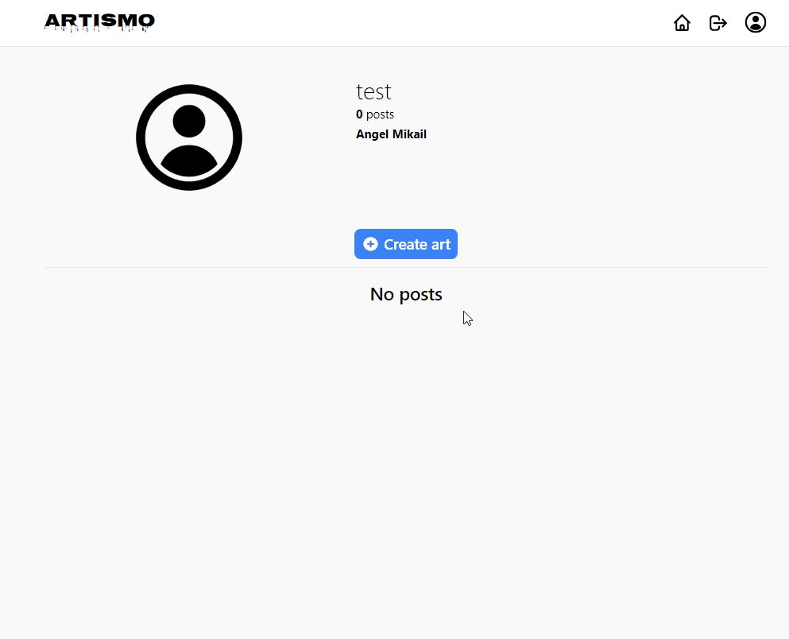
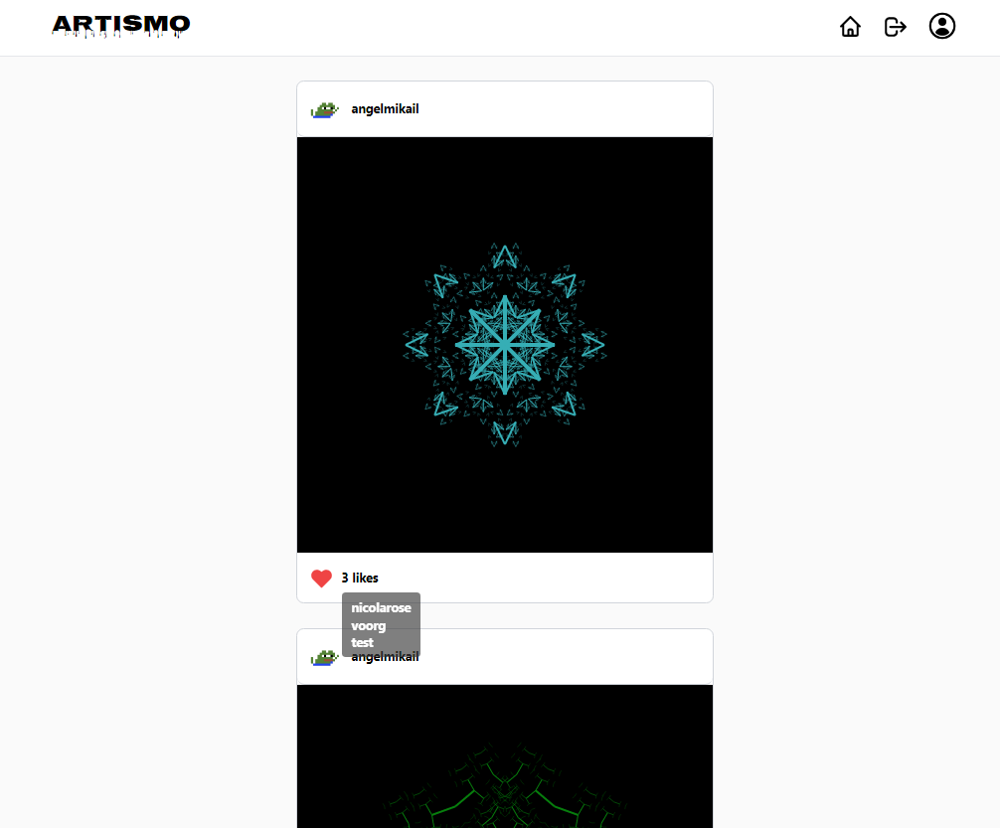

# Artismo

Artismo social media app to share your random generated art with CRUD functionality. You can create your posts and like other people's posts.

## Project

This project was a way for me to learn about how front-end works with back-end via Firebase NoSQL database and how to structure data for app needs.
Also it was a great opportunity to learn more about Tailwind CSS in order to make styling a bit faster.

## Build using:

- React
- Tailwind CSS
- React router
- Firebase
